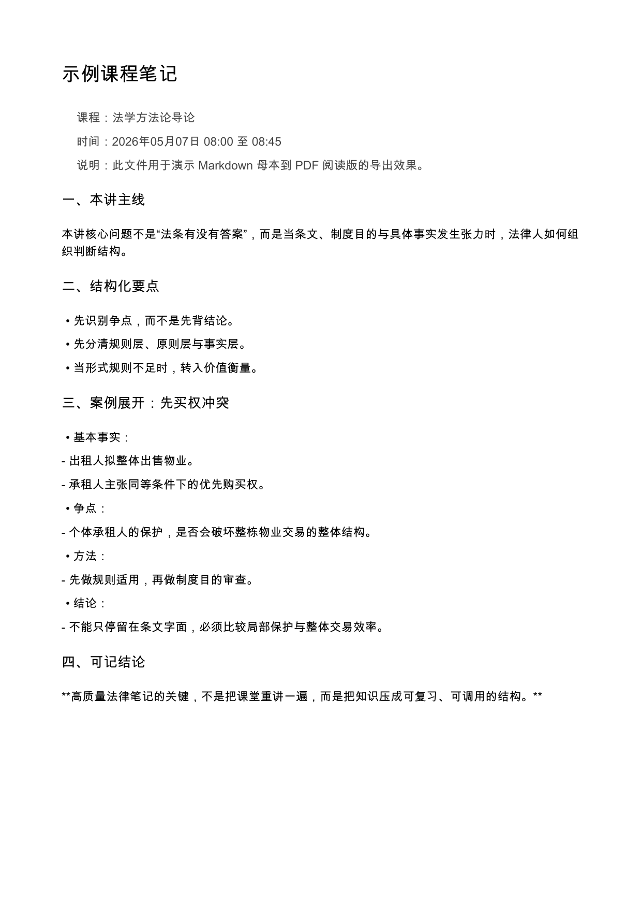

# lecture-notes-pipeline

> Recorded classes turned into PPT-aligned, review-ready study notes.

Pipeline for turning recorded course sessions into PPT-aligned study notes.

The repository is built around a pragmatic workflow:

1. Download or collect lecture videos.
2. Extract audio and run Whisper transcription.
3. Align transcript content to PPT boundaries instead of hard-cutting by session.
4. Resolve noisy transcript fragments against slides or reference notes when there is evidence.
5. Produce compact, review-oriented notes.

## Preview

Exported lecture note sample:



## What this repo does

- Downloads Canvas-hosted recordings when a local logged-in browser session is available.
- Extracts audio with `ffmpeg`.
- Transcribes Chinese lectures with `mlx-whisper`.
- Builds a quick slide text index from PDF decks.
- Runs rough PPT keyword scans over transcripts.
- Supports fuzzy lookup against slides and reference notes for low-confidence fragments.

## Repository layout

- `download_canvas_videos.py`: download Canvas recordings with the smallest available stream.
- `process_lecture.py`: extract audio and transcribe one or more lecture videos.
- `run_course_pipeline.py`: batch wrapper around download and transcription.
- `build_slide_index.py`: extract a quick text preview from PPT PDFs.
- `scan_ppt_hits.py`: rough transcript-to-PPT keyword scan.
- `fuzzy_lookup.py`: fuzzy lookup over slide PDFs and reference notes.
- `clean_transcript.py`: remove obvious noise fragments from transcript text.
- `export_notes_pdf.py`: export Markdown notes into per-note PDFs and one combined PDF.
- `examples/`: sample note source and preview assets for the README.
- `skills/lecture-notes-pipeline/`: Codex skill for running the workflow with stable note-writing rules.

## Requirements

Python packages:

- `requests`
- `mlx-whisper`
- `reportlab`
- `pypdf`
- `python-pptx`

System tools:

- `ffmpeg`
- `pdftotext` (Poppler)

Install Python dependencies:

```bash
python3 -m venv .venv
source .venv/bin/activate
pip install -r requirements.txt
```

## Quick start

Build a slide index:

```bash
python3 build_slide_index.py --ppt-dir /path/to/ppt --output slides_index.md
```

Transcribe local videos:

```bash
python3 process_lecture.py /path/to/video1.mp4 /path/to/video2.mp4
```

Batch download and transcribe:

```bash
python3 run_course_pipeline.py --start 1 --end 6 --step all
```

Recommended for large courses:

```bash
python3 download_canvas_videos.py 1 2 --download --resume --output-dir /path/to/course-root/downloads
python3 process_lecture.py /path/to/course-root/downloads/*.mp4 --audio-dir /path/to/course-root/audio --transcript-dir /path/to/course-root/transcripts
```

Fuzzy lookup for noisy fragments:

```bash
python3 fuzzy_lookup.py "无知之幕" --notes-pdf /path/to/reference-notes.pdf --ppt-dir /path/to/ppt
```

Export notes to PDF:

```bash
python3 export_notes_pdf.py --notes-dir /path/to/notes --output-dir /path/to/exports
```

This generates:

- one PDF per Markdown note
- one combined PDF volume by default

Try the included sample:

```bash
python3 export_notes_pdf.py --notes-dir examples/sample_notes --output-dir examples/rendered
```

## Canvas download configuration

`download_canvas_videos.py` reads an authenticated Canvas token from a local Chrome session storage file.

You can override the defaults with:

- `CANVAS_BASE_URL`
- `CANVAS_SESSION_STORAGE`

By default the script looks at the Chrome `Session Storage/` directory and picks the newest `.log` file.

Or by passing:

```bash
python3 download_canvas_videos.py 4 5 6 --session-storage "/path/to/Session Storage"
```

For SJTU Canvas, the downloader can also reuse an already authenticated `oc.sjtu.edu.cn` cookie and follow the LTI3 handoff to `v.sjtu.edu.cn`:

```bash
python3 download_canvas_videos.py \
  --source sjtu-lti \
  --course-id 123456 \
  --canvas-cookie-file /path/to/cookies.txt \
  --sync-details \
  --output-dir /path/to/course-root/downloads
```

Then download a bounded batch:

```bash
python3 download_canvas_videos.py \
  --source sjtu-lti \
  --course-id 123456 \
  --canvas-cookie-file /path/to/cookies.txt \
  1 2 \
  --download \
  --resume \
  --max-count 2 \
  --output-dir /path/to/course-root/downloads
```

`--canvas-cookie-file` accepts Netscape cookie exports and simple `name=value; name2=value2` cookie header text. You can also pass the header directly with `--canvas-cookie`. This mode does not store account passwords or perform jAccount login; refresh the cookie from your own browser session when it expires.

This script is intentionally local-first. It is designed for workflows where the user is already logged into Canvas in Chrome on the same machine.

For resumable course runs, use the downloader as a small stateful job rather than a long detached process:

```bash
python3 download_canvas_videos.py 4 5 6 --sync-details --output-dir /path/to/course-root/downloads
python3 download_canvas_videos.py 4 5 6 --download --resume --max-count 2 --output-dir /path/to/course-root/downloads
python3 download_canvas_videos.py --verify-only --output-dir /path/to/course-root/downloads
python3 download_canvas_videos.py --status --output-dir /path/to/course-root/downloads
```

The downloader writes:

- `canvas_download_manifest.json`: selected recordings, streams, output paths, and source URLs
- `download_status.json`: per-lecture `pending / downloading / verified / failed` state
- `download_runs/*.jsonl`: run logs for download and verification events

If Canvas exposes multiple recording views and you know the desired `cdviViewNum`, pass `--view-num`. Otherwise the downloader keeps the previous behavior and chooses the smallest downloadable stream.

## Download process hygiene

Do not leave large download jobs hanging in the background.

- Prefer small batches such as `1 2` or `1 2 3`, not the whole semester in one detached process.
- Prefer `--max-count` when automation is driving the work.
- After each batch, verify the expected files landed completely before starting transcription.
- Use `--verify-only` and `--status` before deciding whether more download work is needed.
- If a download job finishes or stalls, clean up the matching `python3 download_canvas_videos.py` and child `curl` processes promptly.
- If you want an explicit cleanup pass, use:

```bash
python3 cleanup_download_jobs.py --list
python3 cleanup_download_jobs.py --kill
```

The cleanup helper only targets downloader jobs from this repo. It does not kill unrelated Python or curl processes.

## Download source stability

For unattended project work, do not make the pipeline depend on an open browser tab.

- Prefer a stable local `downloads/` directory first.
- A symlinked `downloads/` directory is acceptable if the real files live elsewhere.
- If the next lecture video is missing locally, record that as a project gap instead of assuming Canvas is still open in the current thread.
- Treat browser session state as opportunistic input, not as the primary long-term source of truth.
- For SJTU Canvas, prefer `--source sjtu-lti` with a fresh authenticated cookie when Chrome Session Storage does not contain the video-platform token.
- Platform captions are not part of the default workflow. Use local Whisper transcription through `process_lecture.py` for formal note inputs.

## Transcription process hygiene

The same cleanup rule applies to transcription jobs.

- Run one lecture or one small batch at a time.
- After each transcription finishes, verify the expected `.txt` and `.json` files landed.
- Explicitly check for residual `process_lecture.py` processes instead of assuming they exited cleanly.
- If a transcription process is stalled or no longer needed, terminate it before starting new heavy work.

Use:

```bash
python3 cleanup_course_jobs.py --list
python3 cleanup_course_jobs.py --kill
```

## Output conventions

Recommended output structure:

```text
course-root/
  ppt/
  notes/
  transcripts/
  downloads/
  audio/
  slides_index.md
  ppt_processing_queue.md
  uncertain_fragments.md
```

## Note-writing rules

The bundled Codex skill encodes the preferred note style:

- align by PPT/content boundary first, not by session number
- write compact study notes, not classroom narration
- remove teacher/process voice
- expand any case that is actually discussed in class
- only correct low-confidence transcript text when slide or note evidence supports it

If you want Codex to follow those rules consistently, install or reuse the included skill:

- `skills/lecture-notes-pipeline/`

## Publish checklist

Before making the repo public:

- remove any local-only outputs or preview artifacts you do not want to ship
- confirm the Canvas downloader behavior matches what you want to expose publicly
- choose and add a `LICENSE`
- add a few example inputs or screenshots if you want the README to be self-explanatory
